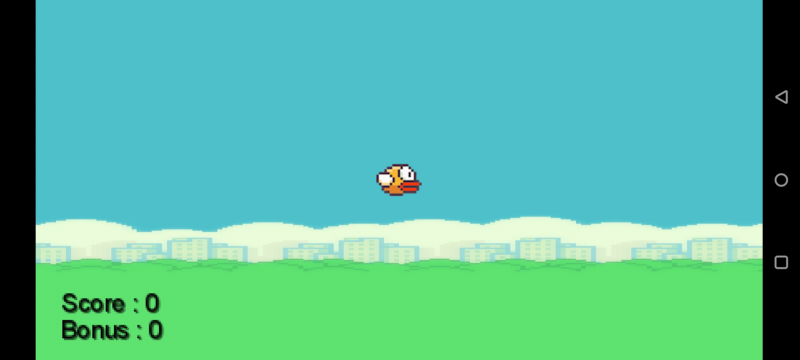
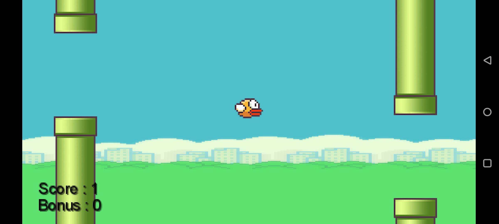
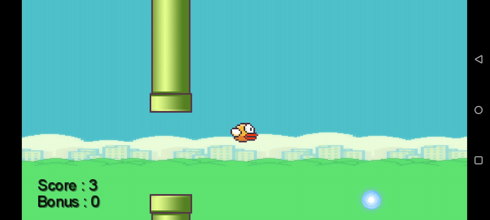

# FlappyBirdPlus

This repository contains the code for the Android game: **FlappyBirdPlus**.

This app is a variation of the traditional game - **Flappy Bird**. 

In Flappy Bird, the player needs to tap the screen to make the bird fly. The goal is to navigate through the incoming pairs of pipes that have equally sized gaps placed at random heights in order to survive.

In FlappyBirdPlus, besides increasing the player score by dodging these pipes, they also gets a chance to earn extra bonus points by collecting the flying magic balls.

Here are a few screenshots of this arcade-style game:-

* Initial game screen

 
    

* Game in progress

 
    

* Flying magic ball on the screen

 
    

* Game over screen

 
    

